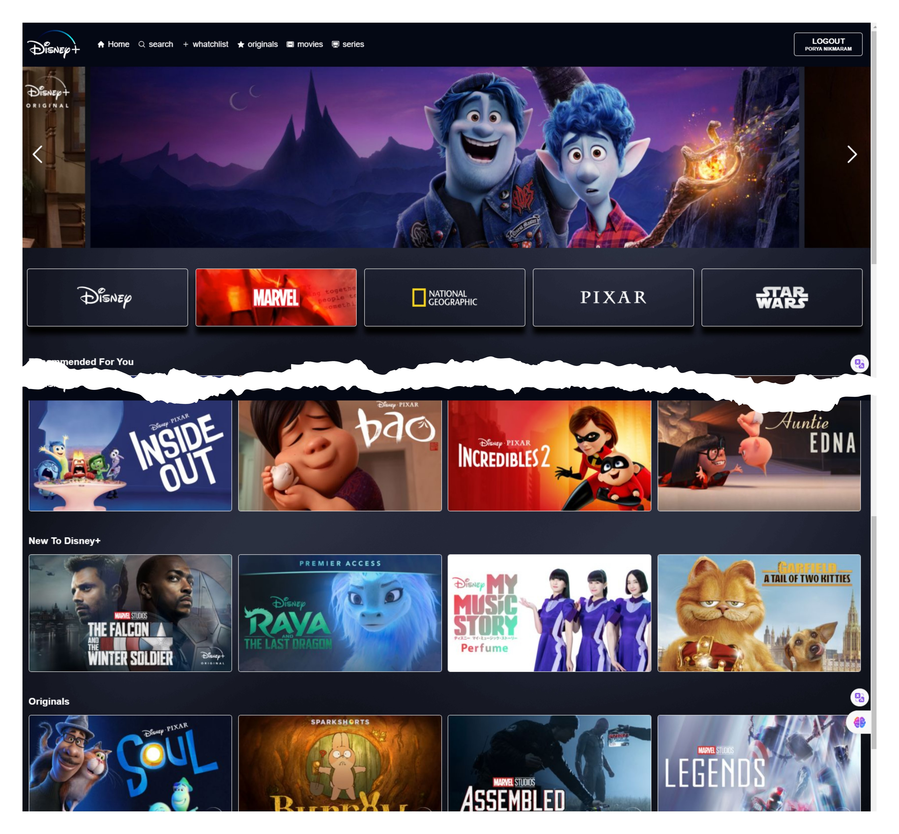
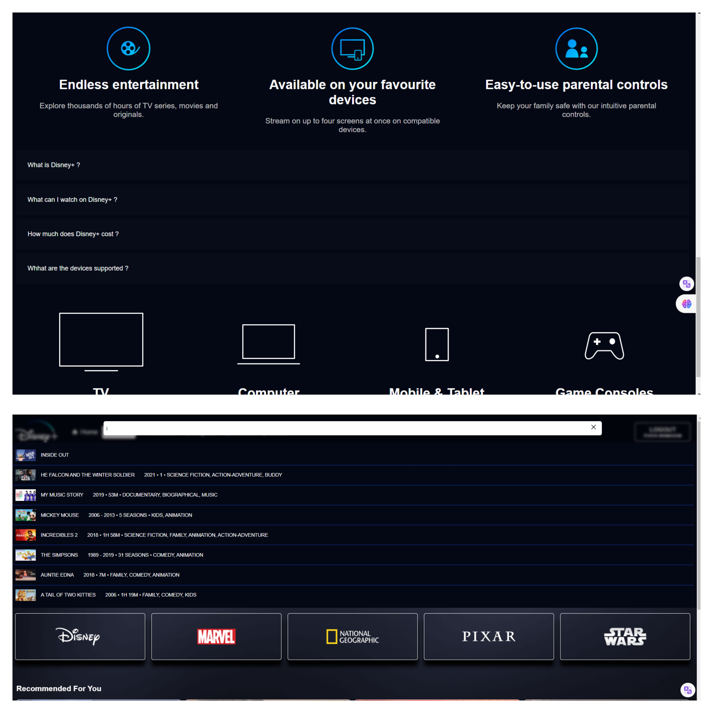

# Disney+ Clone

This is a Disney+ clone web application built using React, Firebase for backend
services, Google Authentication for user authentication, Styled Components for
styling, and Redux Toolkit for state management.

# Features

1- User authentication using Google Authentication 2- Display of movies and TV
shows 3- Search functionality User can add movies and TV shows to their
watchlist 4- Responsive design for different screen sizes

# Technologies Used

ReactJs - Styled Components - Redux Toolkit - Firebase - Google Authentication

# Acknowledgements

This project was inspired by the Disney+ streaming service.
